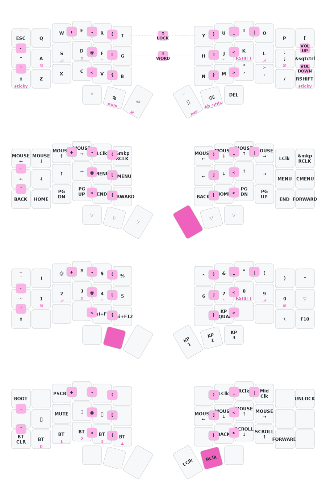

# CORNE ZMK WITH DONGLE 

If you use Corne, Nijuni, Dao or any other keyboard with corne-like matrix you may clone this repo
After that, go to "Actions" tab in github and enable it

You will get archive with firmware

If you use dongle, load "corne_central_dongle-nice-nano-v2-zmk.uf2" if you use nice!nano controller for dongle
Or "corne_central_dongle-seeeduino_xiao_ble-zmk.uf2" if you use xiao for dongle
Also, if you use dongle load "peripheral" uf2 for left and right parts

If you don't use Dongle, than load "corne_central_left-nice_nano_v2-zmk.uf2" on the left part
and "corne_peripheral_right-nice_nano_v2-zmk.uf2" for the right part

## Мысли по дальнейшему улучшению

- возможность зажимать delete как backspace (чтобы удалять много символов)
- переключение языка не по GUI Space, так как это вызывает ложные нажатия Enter (GUI) при смене языка
- цифры в виде numlock (+ слой с символами по другой клавише)
- убрать tap dance по ctrl c ctrl v
- располагать цифры с 1 по 5 в левой руке в верхнем ряду, а дальше в виде numpad  в правой руке
- page up page down как на фото
